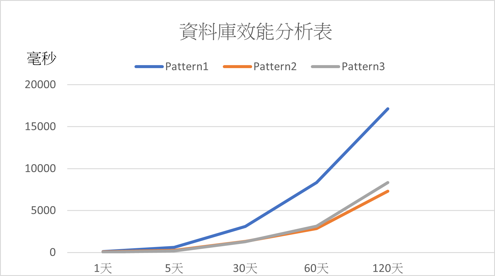

# HbaseDataGenerate
專題，用來產生COVID-19的亂數資料，來做資料庫的使用

Contributors:  
[sShaAanGg](https://github.com/sShaAanGg)  
[Linshuanting](https://github.com/Linshuanting)

## Environment
1. **Centos7.9**
2. **Java-1.8.0_202**
3. **Hadoop-3.2.1**
4. **Zookeeper-3.6.3**
5. **Hbase-2.3.7**
6. **maven-3.8.5**
## Result of our experiment


---
**Please run the commands below at the root directory (HbaseDataGenerate)**
## Compile
```mvn package (or mvn verify)```

## CLASSPATH environment variable
```export CLASSPATH=$HBASE_HOME/lib/*```

## Execute
```java -cp $CLASSPATH:target/HbaseDataGenerate-1.0-SNAPSHOT.jar com.company.DataGenerator```

```java -cp $CLASSPATH:target/HbaseDataGenerate-1.0-SNAPSHOT.jar com.company.MapGenerator```

```java -cp $CLASSPATH:target/HbaseDataGenerate-1.0-SNAPSHOT.jar com.company.PeopleGenerator```

------
## Introduction

地圖大小(size)為1000*1000，有100000個人走訪地圖。     
將100000個人依照下方 living pattern 來走訪，並將生成的資料放置於Hbase中

## Result of our experiment


---
### Pattern 01 Table Design

#### Table01
**row_key**: (String) phonenum  
**columnFamily**: pos   
**columnQualifier**: (long)positionCode 
**value**: (int)placeCode   

#### Table02
**row_key**: (int)placeCode 
**columnFamily**: pho   
**columnQualifier**: (String)phonenum   
**value**: (long)positionCode   

### Pattern 02 Table Design

#### Table03
**row_key**: (String)xxx_phonenum   
**columnFamily**: All_of_the_time   
**columnQualifier**: (String)time   
**value**: (String)placeCode  

#### Table04
**row_key**: (String)xxx_placecode_time   
**columnFamily**: People   
**columnQualifier**: (String)phonenum   
**value**: null

### Pattern 03 Table Design

#### Table03
**row_key**: (String)xxx_phonenum   
**columnFamily**: All_of_the_time   
**columnQualifier**: (String)time   
**value**: (String)placeCode

#### Table05
**row_key**: (String)xxx_placecode   
**columnFamily**: All_position_time   
**columnQualifier**: (String)time   
**value**: phonenum